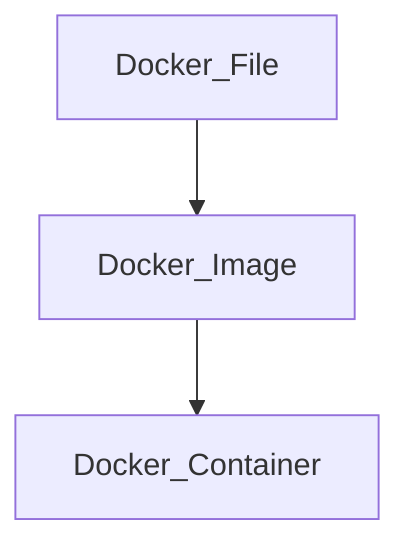

# nd2-learning-journey-2025

## DevOps Concepts for Automation Systems
### แนวคิด DevOps สำหรับระบบอัตโนมัติ: กรณีศึกษา Docker
การพัฒนาระบบอัตโนมัติ (Automation Systems) ในปัจจุบันมีความซับซ้อนสูง เนื่องจากระบบต้องประกอบด้วยหลายบริการที่ทำงานร่วมกัน เช่น ระบบประมวลผลข้อมูล ระบบสื่อสารเครือข่าย และระบบแสดงผลข้อมูล ปัญหาที่พบบ่อยคือความไม่สอดคล้องของสภาพแวดล้อมการพัฒนาและการติดตั้งใช้งาน (deployment environment) ซึ่งส่งผลต่อความเสถียรและความน่าเชื่อถือของระบบ แนวคิด DevOps จึงถูกนำมาใช้เพื่อเชื่อมโยงกระบวนการพัฒนาและการดูแลระบบให้เป็นอัตโนมัติและมีประสิทธิภาพมากขึ้น โดย Docker เป็นเทคโนโลยีสำคัญที่สนับสนุนแนวคิดดังกล่าว

     

### Docker และแนวคิด Containerization

Docker เป็นเทคโนโลยีที่ใช้แนวคิด Containerization ในการบรรจุแอปพลิเคชันพร้อมไลบรารีและการตั้งค่าที่จำเป็นทั้งหมดไว้ในหน่วยเดียวที่เรียกว่า Container ทำให้แอปพลิเคชันสามารถทำงานได้อย่างสม่ำเสมอในทุกสภาพแวดล้อม ไม่ว่าจะเป็นเครื่องพัฒนา ระบบทดสอบ หรือระบบใช้งานจริง Container มีความเบากว่า Virtual Machine เนื่องจากใช้ทรัพยากรร่วมกับระบบปฏิบัติการหลัก ส่งผลให้เหมาะสมกับระบบอัตโนมัติที่ต้องการประสิทธิภาพและความยืดหยุ่นสูง

### การประยุกต์ใช้ Docker ในระบบอัตโนมัติ
### Phase 1: การสร้างสภาพแวดล้อมมาตรฐาน (Environment Standardization)

ในระยะแรก Docker ถูกนำมาใช้เพื่อกำหนดสภาพแวดล้อมมาตรฐานของระบบผ่าน Docker Image ซึ่งนิยามด้วยไฟล์ Dockerfile ภายในจะระบุ runtime ไลบรารี และการตั้งค่าที่จำเป็นทั้งหมด แนวทางนี้ช่วยลดปัญหาความแตกต่างของสภาพแวดล้อมระหว่างผู้พัฒนาและระบบใช้งานจริง ทำให้ระบบอัตโนมัติสามารถทำงานได้อย่างถูกต้องและสม่ำเสมอ

### Phase 2: การบรรจุแอปพลิเคชัน (Application Containerization)

ในขั้นตอนนี้ ระบบอัตโนมัติจะถูกแยกออกเป็นส่วนย่อยตามหน้าที่ เช่น ระบบรวบรวมข้อมูล ระบบประมวลผล และระบบแสดงผล โดยแต่ละส่วนจะถูกรันอยู่ใน Container แยกจากกัน การแยกส่วนดังกล่าวช่วยลดผลกระทบเมื่อเกิดความผิดพลาดในบางบริการ และเพิ่มความสะดวกในการพัฒนาและปรับปรุงระบบเป็นรายส่วน

### Phase 3: การทำงานอัตโนมัติและกระบวนการ CI/CD

Docker ถูกผนวกเข้ากับกระบวนการ Continuous Integration และ Continuous Deployment (CI/CD) เพื่อทำให้การสร้าง ทดสอบ และติดตั้งระบบเป็นไปโดยอัตโนมัติ เมื่อมีการเปลี่ยนแปลงโค้ด ระบบสามารถสร้าง Docker Image ใหม่ ทำการทดสอบ และนำไปติดตั้งได้ทันที กระบวนการนี้ช่วยลดข้อผิดพลาดจากมนุษย์ และเพิ่มความรวดเร็วในการพัฒนาระบบอัตโนมัติ

### Phase 4: การติดตั้งใช้งานและการขยายระบบ (Deployment and Scalability)

Docker ช่วยให้การติดตั้งระบบอัตโนมัติทำได้ง่ายและมีความยืดหยุ่นสูง โดยสามารถนำ Docker Image เดิมไปใช้งานในหลายสภาพแวดล้อม รวมถึงการเพิ่มจำนวน Container เพื่อรองรับภาระงานที่เพิ่มขึ้น แนวทางนี้ช่วยให้ระบบสามารถขยายตัวได้ตามความต้องการโดยไม่ต้องปรับโครงสร้างระบบใหม่ทั้งหมด

### Phase 5: การดูแลรักษาและความเสถียรของระบบ (Operation and Maintenance)

ในระยะการใช้งานจริง Docker สนับสนุนการดูแลระบบอัตโนมัติในระยะยาว เช่น การรีสตาร์ตบริการที่เกิดความผิดพลาด การย้อนกลับเวอร์ชัน (rollback) และการแยกตรวจสอบปัญหาเป็นราย Container ส่งผลให้ระบบมีความเสถียรและลดระยะเวลาหยุดทำงาน (downtime)

### บทสรุป

Docker เป็นองค์ประกอบสำคัญของแนวคิด DevOps สำหรับระบบอัตโนมัติ โดยช่วยเปลี่ยนกระบวนการพัฒนาระบบจากการดำเนินการแบบแมนนวลไปสู่ระบบอัตโนมัติที่มีมาตรฐานเดียวกัน ช่วยเพิ่มความน่าเชื่อถือ ความยืดหยุ่น และความสามารถในการขยายระบบ การประยุกต์ใช้ Docker จึงเป็นพื้นฐานสำคัญสำหรับการพัฒนาระบบอัตโนมัติและระบบอัจฉริยะในยุคปัจจุบัน
## Front-End & Back-End
การพัฒนาแอปพลิเคชันสมัยใหม่จำเป็นต้องอาศัยการทำงานร่วมกันระหว่าง Front-End และ Back-End อย่างเป็นระบบ เพื่อรองรับความซับซ้อนของข้อมูล ประสบการณ์ผู้ใช้ และความสามารถในการขยายระบบ ภาษา TypeScript ได้รับความนิยมอย่างแพร่หลายในการพัฒนา Full-Stack เนื่องจากเป็นการต่อยอดจาก JavaScript ที่เพิ่มความสามารถด้าน static typing ช่วยลดข้อผิดพลาดของโปรแกรมและเพิ่มความน่าเชื่อถือของซอฟต์แวร์ในระดับระบบ

    

### แนวคิด Front-End และ Back-End ด้วย TypeScript
### Front-End ด้วย TypeScript

Front-End มีหน้าที่รับผิดชอบด้านการโต้ตอบกับผู้ใช้ (User Interface) และการแสดงผลข้อมูล TypeScript ถูกนำมาใช้ร่วมกับเฟรมเวิร์กฝั่งผู้ใช้ เช่น React หรือ Angular เพื่อช่วยตรวจสอบชนิดข้อมูล (type checking) ระหว่างการพัฒนา ส่งผลให้โค้ดมีความชัดเจน ดูแลรักษาง่าย และลดข้อผิดพลาดที่เกิดในระยะ runtime

### Back-End ด้วย TypeScript

Back-End ทำหน้าที่จัดการตรรกะของระบบ (Business Logic) การเชื่อมต่อฐานข้อมูล และการให้บริการ API โดย TypeScript มักถูกใช้งานร่วมกับ Node.js เพื่อสร้าง REST API หรือ WebSocket Service การใช้ TypeScript ในฝั่ง Back-End ช่วยให้โครงสร้างข้อมูลที่ส่งระหว่างระบบมีความสอดคล้องกับฝั่ง Front-End และลดความคลาดเคลื่อนของข้อมูล

### การพัฒนา Front-End และ Back-End ด้วย TypeScript
### Phase 1: การกำหนดโครงสร้างระบบ (System Design)

กระบวนการเริ่มต้นจากการออกแบบสถาปัตยกรรมของระบบ โดยกำหนดขอบเขตความรับผิดชอบของ Front-End และ Back-End อย่างชัดเจน เช่น การแยกส่วนการแสดงผลออกจากการประมวลผลข้อมูล รวมถึงการกำหนดรูปแบบการสื่อสารผ่าน API การออกแบบในระยะนี้ช่วยลดความซับซ้อนในระยะพัฒนาและเพิ่มความสามารถในการขยายระบบในอนาคต

### Phase 2: การจัดการชนิดข้อมูล (Type Definition)

ในขั้นตอนนี้ TypeScript ถูกนำมาใช้เพื่อกำหนดโครงสร้างของข้อมูล เช่น Interface และ Type ซึ่งใช้ร่วมกันทั้งฝั่ง Front-End และ Back-End การกำหนดชนิดข้อมูลที่ชัดเจนช่วยให้การแลกเปลี่ยนข้อมูลผ่าน API มีความถูกต้องและลดข้อผิดพลาดจากการตีความข้อมูลไม่ตรงกัน

### Phase 3: การพัฒนา Back-End API

Back-End จะถูกพัฒนาเพื่อให้บริการข้อมูลและฟังก์ชันของระบบผ่าน API โดยใช้ TypeScript เป็นตัวช่วยในการตรวจสอบความถูกต้องของข้อมูลและตรรกะการทำงาน ขั้นตอนนี้รวมถึงการจัดการข้อผิดพลาด การตรวจสอบความปลอดภัย และการเชื่อมต่อกับฐานข้อมูล ซึ่งเป็นหัวใจสำคัญของระบบ

### Phase 4: การพัฒนา Front-End Application

Front-End จะเชื่อมต่อกับ API ที่พัฒนาขึ้น โดยใช้ TypeScript เพื่อจัดการ state และข้อมูลที่ได้รับจาก Back-End การใช้ TypeScript ช่วยให้การเรียกใช้งาน API มีความสอดคล้องกับโครงสร้างข้อมูลที่กำหนดไว้ และลดความผิดพลาดในการแสดงผลข้อมูลต่อผู้ใช้

### Phase 5: การทดสอบและบูรณาการระบบ (Testing and Integration)

เมื่อทั้งสองส่วนถูกพัฒนาแล้ว ระบบจะเข้าสู่ขั้นตอนการทดสอบร่วมกัน ทั้งในระดับหน่วยย่อย (Unit Test) และระดับระบบ (Integration Test) TypeScript ช่วยให้สามารถตรวจจับข้อผิดพลาดด้านชนิดข้อมูลได้ตั้งแต่ระยะพัฒนา ลดปัญหาที่อาจเกิดขึ้นในระยะใช้งานจริง

### Phase 6: การปรับใช้และดูแลระบบ (Deployment and Maintenance)

ในระยะสุดท้าย ระบบจะถูกนำไปปรับใช้ในสภาพแวดล้อมจริง การใช้ TypeScript ร่วมกับเครื่องมือ DevOps ช่วยให้การปรับใช้เป็นไปอย่างมีระบบ และเอื้อต่อการบำรุงรักษาและพัฒนาต่อยอดระบบในระยะยาว

## Data Processing and AI

## Deployment & Automation Workflow

## Future Works/Projects
