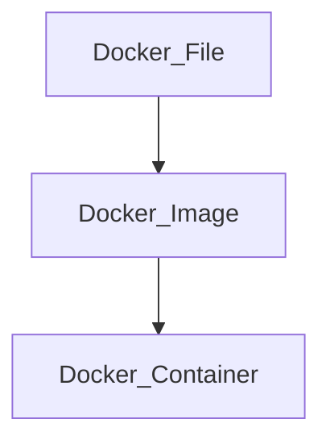
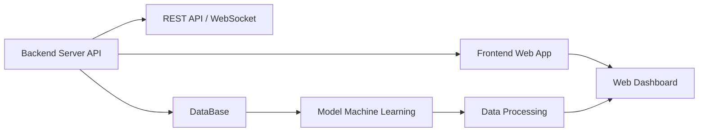

# nd2-learning-journey-2025

## DevOps Concepts for Automation Systems
### แนวคิด DevOps สำหรับระบบอัตโนมัติ: กรณีศึกษา Docker
การพัฒนาระบบอัตโนมัติ (Automation Systems) ในปัจจุบันมีความซับซ้อนสูง เนื่องจากระบบต้องประกอบด้วยหลายบริการที่ทำงานร่วมกัน เช่น ระบบประมวลผลข้อมูล ระบบสื่อสารเครือข่าย และระบบแสดงผลข้อมูล ปัญหาที่พบบ่อยคือความไม่สอดคล้องของสภาพแวดล้อมการพัฒนาและการติดตั้งใช้งาน (deployment environment) ซึ่งส่งผลต่อความเสถียรและความน่าเชื่อถือของระบบ แนวคิด DevOps จึงถูกนำมาใช้เพื่อเชื่อมโยงกระบวนการพัฒนาและการดูแลระบบให้เป็นอัตโนมัติและมีประสิทธิภาพมากขึ้น โดย Docker เป็นเทคโนโลยีสำคัญที่สนับสนุนแนวคิดดังกล่าว

     

### Docker และแนวคิด Containerization

Docker เป็นเทคโนโลยีที่ใช้แนวคิด Containerization ในการบรรจุแอปพลิเคชันพร้อมไลบรารีและการตั้งค่าที่จำเป็นทั้งหมดไว้ในหน่วยเดียวที่เรียกว่า Container ทำให้แอปพลิเคชันสามารถทำงานได้อย่างสม่ำเสมอในทุกสภาพแวดล้อม ไม่ว่าจะเป็นเครื่องพัฒนา ระบบทดสอบ หรือระบบใช้งานจริง Container มีความเบากว่า Virtual Machine เนื่องจากใช้ทรัพยากรร่วมกับระบบปฏิบัติการหลัก ส่งผลให้เหมาะสมกับระบบอัตโนมัติที่ต้องการประสิทธิภาพและความยืดหยุ่นสูง

### การประยุกต์ใช้ Docker ในระบบอัตโนมัติ
### Phase 1: การสร้างสภาพแวดล้อมมาตรฐาน (Environment Standardization)

ในระยะแรก Docker ถูกนำมาใช้เพื่อกำหนดสภาพแวดล้อมมาตรฐานของระบบผ่าน Docker Image ซึ่งนิยามด้วยไฟล์ Dockerfile ภายในจะระบุ runtime ไลบรารี และการตั้งค่าที่จำเป็นทั้งหมด แนวทางนี้ช่วยลดปัญหาความแตกต่างของสภาพแวดล้อมระหว่างผู้พัฒนาและระบบใช้งานจริง ทำให้ระบบอัตโนมัติสามารถทำงานได้อย่างถูกต้องและสม่ำเสมอ

### Phase 2: การบรรจุแอปพลิเคชัน (Application Containerization)

ในขั้นตอนนี้ ระบบอัตโนมัติจะถูกแยกออกเป็นส่วนย่อยตามหน้าที่ เช่น ระบบรวบรวมข้อมูล ระบบประมวลผล และระบบแสดงผล โดยแต่ละส่วนจะถูกรันอยู่ใน Container แยกจากกัน การแยกส่วนดังกล่าวช่วยลดผลกระทบเมื่อเกิดความผิดพลาดในบางบริการ และเพิ่มความสะดวกในการพัฒนาและปรับปรุงระบบเป็นรายส่วน

### Phase 3: การทำงานอัตโนมัติและกระบวนการ CI/CD

Docker ถูกผนวกเข้ากับกระบวนการ Continuous Integration และ Continuous Deployment (CI/CD) เพื่อทำให้การสร้าง ทดสอบ และติดตั้งระบบเป็นไปโดยอัตโนมัติ เมื่อมีการเปลี่ยนแปลงโค้ด ระบบสามารถสร้าง Docker Image ใหม่ ทำการทดสอบ และนำไปติดตั้งได้ทันที กระบวนการนี้ช่วยลดข้อผิดพลาดจากมนุษย์ และเพิ่มความรวดเร็วในการพัฒนาระบบอัตโนมัติ

### Phase 4: การติดตั้งใช้งานและการขยายระบบ (Deployment and Scalability)

Docker ช่วยให้การติดตั้งระบบอัตโนมัติทำได้ง่ายและมีความยืดหยุ่นสูง โดยสามารถนำ Docker Image เดิมไปใช้งานในหลายสภาพแวดล้อม รวมถึงการเพิ่มจำนวน Container เพื่อรองรับภาระงานที่เพิ่มขึ้น แนวทางนี้ช่วยให้ระบบสามารถขยายตัวได้ตามความต้องการโดยไม่ต้องปรับโครงสร้างระบบใหม่ทั้งหมด

### Phase 5: การดูแลรักษาและความเสถียรของระบบ (Operation and Maintenance)

ในระยะการใช้งานจริง Docker สนับสนุนการดูแลระบบอัตโนมัติในระยะยาว เช่น การรีสตาร์ตบริการที่เกิดความผิดพลาด การย้อนกลับเวอร์ชัน (rollback) และการแยกตรวจสอบปัญหาเป็นราย Container ส่งผลให้ระบบมีความเสถียรและลดระยะเวลาหยุดทำงาน (downtime)

### บทสรุป

Docker เป็นองค์ประกอบสำคัญของแนวคิด DevOps สำหรับระบบอัตโนมัติ โดยช่วยเปลี่ยนกระบวนการพัฒนาระบบจากการดำเนินการแบบแมนนวลไปสู่ระบบอัตโนมัติที่มีมาตรฐานเดียวกัน ช่วยเพิ่มความน่าเชื่อถือ ความยืดหยุ่น และความสามารถในการขยายระบบ การประยุกต์ใช้ Docker จึงเป็นพื้นฐานสำคัญสำหรับการพัฒนาระบบอัตโนมัติและระบบอัจฉริยะในยุคปัจจุบัน
## Front-End & Back-End
การพัฒนาแอปพลิเคชันสมัยใหม่จำเป็นต้องอาศัยการทำงานร่วมกันระหว่าง Front-End และ Back-End อย่างเป็นระบบ เพื่อรองรับความซับซ้อนของข้อมูล ประสบการณ์ผู้ใช้ และความสามารถในการขยายระบบ ภาษา TypeScript ได้รับความนิยมอย่างแพร่หลายในการพัฒนา Full-Stack เนื่องจากเป็นการต่อยอดจาก JavaScript ที่เพิ่มความสามารถด้าน static typing ช่วยลดข้อผิดพลาดของโปรแกรมและเพิ่มความน่าเชื่อถือของซอฟต์แวร์ในระดับระบบ

    

### แนวคิด Front-End และ Back-End ด้วย TypeScript
### Front-End ด้วย TypeScript

Front-End มีหน้าที่รับผิดชอบด้านการโต้ตอบกับผู้ใช้ (User Interface) และการแสดงผลข้อมูล TypeScript ถูกนำมาใช้ร่วมกับเฟรมเวิร์กฝั่งผู้ใช้ เช่น React หรือ Angular เพื่อช่วยตรวจสอบชนิดข้อมูล (type checking) ระหว่างการพัฒนา ส่งผลให้โค้ดมีความชัดเจน ดูแลรักษาง่าย และลดข้อผิดพลาดที่เกิดในระยะ runtime

### Back-End ด้วย TypeScript

Back-End ทำหน้าที่จัดการตรรกะของระบบ (Business Logic) การเชื่อมต่อฐานข้อมูล และการให้บริการ API โดย TypeScript มักถูกใช้งานร่วมกับ Node.js เพื่อสร้าง REST API หรือ WebSocket Service การใช้ TypeScript ในฝั่ง Back-End ช่วยให้โครงสร้างข้อมูลที่ส่งระหว่างระบบมีความสอดคล้องกับฝั่ง Front-End และลดความคลาดเคลื่อนของข้อมูล

### การพัฒนา Front-End และ Back-End ด้วย TypeScript
### Phase 1: การกำหนดโครงสร้างระบบ (System Design)

กระบวนการเริ่มต้นจากการออกแบบสถาปัตยกรรมของระบบ โดยกำหนดขอบเขตความรับผิดชอบของ Front-End และ Back-End อย่างชัดเจน เช่น การแยกส่วนการแสดงผลออกจากการประมวลผลข้อมูล รวมถึงการกำหนดรูปแบบการสื่อสารผ่าน API การออกแบบในระยะนี้ช่วยลดความซับซ้อนในระยะพัฒนาและเพิ่มความสามารถในการขยายระบบในอนาคต

### Phase 2: การจัดการชนิดข้อมูล (Type Definition)

ในขั้นตอนนี้ TypeScript ถูกนำมาใช้เพื่อกำหนดโครงสร้างของข้อมูล เช่น Interface และ Type ซึ่งใช้ร่วมกันทั้งฝั่ง Front-End และ Back-End การกำหนดชนิดข้อมูลที่ชัดเจนช่วยให้การแลกเปลี่ยนข้อมูลผ่าน API มีความถูกต้องและลดข้อผิดพลาดจากการตีความข้อมูลไม่ตรงกัน

### Phase 3: การพัฒนา Back-End API

Back-End จะถูกพัฒนาเพื่อให้บริการข้อมูลและฟังก์ชันของระบบผ่าน API โดยใช้ TypeScript เป็นตัวช่วยในการตรวจสอบความถูกต้องของข้อมูลและตรรกะการทำงาน ขั้นตอนนี้รวมถึงการจัดการข้อผิดพลาด การตรวจสอบความปลอดภัย และการเชื่อมต่อกับฐานข้อมูล ซึ่งเป็นหัวใจสำคัญของระบบ

### Phase 4: การพัฒนา Front-End Application

Front-End จะเชื่อมต่อกับ API ที่พัฒนาขึ้น โดยใช้ TypeScript เพื่อจัดการ state และข้อมูลที่ได้รับจาก Back-End การใช้ TypeScript ช่วยให้การเรียกใช้งาน API มีความสอดคล้องกับโครงสร้างข้อมูลที่กำหนดไว้ และลดความผิดพลาดในการแสดงผลข้อมูลต่อผู้ใช้

### Phase 5: การทดสอบและบูรณาการระบบ (Testing and Integration)

เมื่อทั้งสองส่วนถูกพัฒนาแล้ว ระบบจะเข้าสู่ขั้นตอนการทดสอบร่วมกัน ทั้งในระดับหน่วยย่อย (Unit Test) และระดับระบบ (Integration Test) TypeScript ช่วยให้สามารถตรวจจับข้อผิดพลาดด้านชนิดข้อมูลได้ตั้งแต่ระยะพัฒนา ลดปัญหาที่อาจเกิดขึ้นในระยะใช้งานจริง

### Phase 6: การปรับใช้และดูแลระบบ (Deployment and Maintenance)

ในระยะสุดท้าย ระบบจะถูกนำไปปรับใช้ในสภาพแวดล้อมจริง การใช้ TypeScript ร่วมกับเครื่องมือ DevOps ช่วยให้การปรับใช้เป็นไปอย่างมีระบบ และเอื้อต่อการบำรุงรักษาและพัฒนาต่อยอดระบบในระยะยาว

## Data Processing and AI
### TensorFlow.js
การประมวลผลข้อมูลและปัญญาประดิษฐ์ (Data Processing and Artificial Intelligence) มีบทบาทสำคัญในระบบสารสนเทศสมัยใหม่ โดยเฉพาะระบบที่ต้องการการตัดสินใจจากข้อมูลแบบอัตโนมัติ TensorFlow.js เป็นไลบรารีสำหรับการพัฒนาโมเดลปัญญาประดิษฐ์ที่สามารถทำงานบนสภาพแวดล้อม JavaScript ทั้งฝั่งเว็บเบราว์เซอร์และฝั่งเซิร์ฟเวอร์ ช่วยให้สามารถนำ AI ไปใช้งานใกล้ผู้ใช้หรืออุปกรณ์ปลายทางได้มากขึ้น ลดการพึ่งพาการประมวลผลบนคลาวด์เพียงอย่างเดียว

### TensorFlow.js และแนวคิดหลัก
TensorFlow.js เป็นเวอร์ชันของ TensorFlow ที่พัฒนาสำหรับ JavaScript รองรับการสร้าง การฝึกสอน (training) และการใช้งานโมเดลปัญญาประดิษฐ์ (inference) โดยใช้โครงสร้างข้อมูลแบบ Tensor ซึ่งช่วยจัดการข้อมูลเชิงตัวเลขหลายมิติอย่างมีประสิทธิภาพ จุดเด่นของ TensorFlow.js คือความสามารถในการทำงานร่วมกับระบบเว็บและระบบ Back-End ที่พัฒนาด้วย JavaScript/TypeScript ได้โดยตรง
### การประมวลผลข้อมูลและพัฒนา AI ด้วย TensorFlow.js
### Phase 1: Data Acquisition – การรวบรวมข้อมูล
กระบวนการเริ่มต้นจากการรวบรวมข้อมูลจากแหล่งต่างๆ เช่น ข้อมูลเซ็นเซอร์ ข้อมูลผู้ใช้ หรือข้อมูลจากฐานข้อมูล ข้อมูลเหล่านี้จะถูกนำเข้ามาในระบบ JavaScript เพื่อเตรียมเข้าสู่กระบวนการประมวลผลและการเรียนรู้ของโมเดล
### Phase 2: Data Preprocessing – การเตรียมและประมวลผลข้อมูล
ในขั้นตอนนี้ ข้อมูลดิบจะถูกทำความสะอาดและปรับรูปแบบ เช่น การลบค่าผิดปกติ การปรับขนาดข้อมูล (normalization) และการแปลงข้อมูลให้อยู่ในรูปของ Tensor เพื่อให้เหมาะสมกับการประมวลผลของ TensorFlow.js ขั้นตอนนี้มีความสำคัญต่อคุณภาพของโมเดลปัญญาประดิษฐ์โดยตรง
### Phase 3: Model Design – การออกแบบโมเดล
หลังจากเตรียมข้อมูลแล้ว จะเข้าสู่ขั้นตอนการออกแบบโครงสร้างโมเดลปัญญาประดิษฐ์ เช่น โมเดลเชิงเส้น โมเดลโครงข่ายประสาทเทียม (Neural Network) หรือโมเดลเชิงลึก (Deep Learning) TensorFlow.js รองรับการสร้างโมเดลด้วย API ระดับสูง ทำให้สามารถปรับโครงสร้างโมเดลให้เหมาะสมกับลักษณะของข้อมูลและปัญหาได้
### Phase 4: Model Training – การฝึกสอนโมเดล
โมเดลที่ออกแบบจะถูกนำมาฝึกสอนโดยใช้ข้อมูลที่ผ่านการเตรียมแล้ว TensorFlow.js รองรับการฝึกโมเดลทั้งในฝั่งเซิร์ฟเวอร์และในเว็บเบราว์เซอร์ การฝึกสอนจะช่วยให้โมเดลเรียนรู้ความสัมพันธ์ของข้อมูล และปรับค่าพารามิเตอร์เพื่อเพิ่มความแม่นยำในการทำนาย
### Phase 5: Model Evaluation – การประเมินผล
หลังจากการฝึกสอน โมเดลจะถูกประเมินประสิทธิภาพด้วยข้อมูลทดสอบ โดยพิจารณาค่าความแม่นยำ ความคลาดเคลื่อน และตัวชี้วัดอื่นๆ การประเมินผลช่วยให้สามารถปรับปรุงโมเดลก่อนนำไปใช้งานจริง
### Phase 6: Deployment and Inference – การนำไปใช้งาน
ในขั้นตอนสุดท้าย โมเดลที่ผ่านการฝึกสอนแล้วจะถูกนำไปใช้งานจริง เช่น การวิเคราะห์ข้อมูลแบบ real-time บนเว็บแอปพลิเคชัน หรือการประมวลผลข้อมูลใกล้อุปกรณ์ปลายทาง (Edge AI) ด้วย TensorFlow.js แนวทางนี้ช่วยลดเวลาแฝงในการสื่อสารข้อมูล และเพิ่มความเป็นส่วนตัวของข้อมูล

## Deployment & Automation Workflow
การพัฒนาระบบสารสนเทศและระบบอัตโนมัติในปัจจุบันจำเป็นต้องอาศัยเครื่องมือ (Tools) เพื่อสนับสนุนกระบวนการ Deployment และ Automation ให้มีความถูกต้อง รวดเร็ว และลดข้อผิดพลาดจากมนุษย์ การเลือกใช้เครื่องมือที่เหมาะสมในแต่ละขั้นตอนของ Workflow เป็นปัจจัยสำคัญที่ส่งผลต่อความเสถียรและประสิทธิภาพของระบบโดยรวม

 

### Tools ที่น่าใช้
### Phase 1: Source Code Management Tools
ในขั้นตอนเริ่มต้น เครื่องมือควบคุมเวอร์ชัน เช่น Git ถูกใช้เพื่อจัดการซอร์สโค้ดและติดตามการเปลี่ยนแปลงของระบบ เครื่องมือนี้ช่วยให้ทีมพัฒนาสามารถทำงานร่วมกันได้อย่างเป็นระบบ รองรับการแยกสาขาการพัฒนา (branching) และการรวมโค้ด (merging) ซึ่งเป็นพื้นฐานของกระบวนการอัตโนมัติในลำดับถัดไป
### Phase 2: Continuous Integration Tools
เมื่อมีการเปลี่ยนแปลงซอร์สโค้ด เครื่องมือ Continuous Integration (CI) เช่น Jenkins หรือ GitHub Actions จะถูกใช้เพื่อตรวจสอบคุณภาพของโค้ดโดยอัตโนมัติ เครื่องมือเหล่านี้สามารถทำการ build และทดสอบซอฟต์แวร์ทันที ลดความเสี่ยงจากการรวมโค้ดที่มีข้อผิดพลาดเข้าสู่ระบบหลัก
### Phase 3: Build and Containerization Tools
ในขั้นตอนการสร้างแพ็กเกจซอฟต์แวร์ เครื่องมือ Docker ถูกนำมาใช้เพื่อบรรจุแอปพลิเคชันพร้อม dependency ทั้งหมดไว้ใน container เดียว แนวทางนี้ช่วยให้ซอฟต์แวร์สามารถทำงานได้อย่างสม่ำเสมอในทุกสภาพแวดล้อม และเป็นรากฐานสำคัญของการ deployment แบบอัตโนมัติ
### Phase 4: Deployment and Orchestration Tools
การนำระบบไปใช้งานจริงต้องอาศัยเครื่องมือสำหรับการ deployment และการจัดการ container เช่น Docker Compose หรือ Kubernetes เครื่องมือเหล่านี้ช่วยควบคุมการรัน การขยายจำนวนบริการ และการจัดการทรัพยากรของระบบอัตโนมัติได้อย่างเป็นระบบ
### Phase 5: Configuration and Automation Tools
เพื่อให้การตั้งค่าระบบเป็นไปอย่างอัตโนมัติ เครื่องมืออย่าง Ansible หรือ Terraform ถูกใช้ในการจัดการ configuration และโครงสร้างพื้นฐาน เครื่องมือเหล่านี้ช่วยลดการตั้งค่าด้วยมือ และเพิ่มความสามารถในการทำซ้ำ (reproducibility) ของระบบ
### Phase 6: Monitoring and Logging Tools
หลังจากการ deployment เครื่องมือด้านการติดตามและบันทึกข้อมูล เช่น Prometheus และ Grafana จะถูกใช้เพื่อตรวจสอบประสิทธิภาพของระบบและสถานะการทำงาน ข้อมูลจากเครื่องมือเหล่านี้ช่วยให้ผู้ดูแลระบบสามารถตรวจพบปัญหาและปรับปรุงระบบได้อย่างต่อเนื่อง

## Future Works/Projects
### การพัฒนาระบบตรวจวัดความเค็มของดินและรายงานสภาพแวดล้อมด้วยเทคโนโลยี IoT ผ่านเครือข่าย 4G

### (IoT-Based Soil Salinity and Environmental Monitoring and Reporting System Using 4G Communication) 

### การทำงานของระบบ (System Workflow)
### Phase 1: Backend Service and API Layer

กระบวนการเริ่มต้นจาก Backend Server API ซึ่งทำหน้าที่เป็นแกนกลางของระบบ Backend มีหน้าที่จัดการตรรกะการทำงานหลัก เช่น การรับ–ส่งข้อมูล การตรวจสอบความถูกต้องของข้อมูล และการจัดการสิทธิ์การเข้าถึง Backend จะให้บริการข้อมูลผ่าน REST API และ WebSocket เพื่อรองรับทั้งการเรียกใช้งานแบบ request/response และการสื่อสารแบบ real-time

### Phase 2: Data Storage and Management

ข้อมูลที่ถูกส่งเข้ามาจาก Backend จะถูกจัดเก็บใน Database ซึ่งทำหน้าที่เป็นแหล่งข้อมูลกลางของระบบ ฐานข้อมูลนี้รองรับการจัดเก็บข้อมูลเชิงประวัติและข้อมูลที่ใช้ในการวิเคราะห์ในอนาคต การแยก Database ออกจาก Backend ช่วยเพิ่มความยืดหยุ่นและรองรับการขยายระบบในระดับข้อมูลได้อย่างมีประสิทธิภาพ

### Phase 3: Machine Learning Model Integration

ข้อมูลที่จัดเก็บใน Database จะถูกนำไปใช้ในกระบวนการ Model Machine Learning เพื่อทำการวิเคราะห์ คาดการณ์ หรือจำแนกรูปแบบของข้อมูล ขั้นตอนนี้ถือเป็นส่วนสำคัญที่เพิ่มความสามารถเชิงอัจฉริยะให้กับระบบ โดยโมเดลสามารถนำข้อมูลในอดีตมาเรียนรู้และสร้างผลลัพธ์ที่มีคุณค่าเชิงการตัดสินใจ

### Phase 4: Data Processing and Transformation

ผลลัพธ์ที่ได้จากโมเดล Machine Learning จะถูกส่งต่อไปยังส่วน Data Processing เพื่อทำการแปลงข้อมูลให้อยู่ในรูปแบบที่เหมาะสมต่อการแสดงผล เช่น การสรุปค่า การจัดกลุ่มข้อมูล หรือการคำนวณตัวชี้วัด ข้อมูลในขั้นตอนนี้ถูกเตรียมให้พร้อมสำหรับการนำเสนอแก่ผู้ใช้งาน

### Phase 5: Frontend Web Application

ข้อมูลที่ผ่านการประมวลผลแล้วจะถูกส่งไปยัง Frontend Web App ผ่าน REST API หรือ WebSocket Frontend มีหน้าที่จัดการส่วนติดต่อผู้ใช้ (User Interface) และการโต้ตอบกับผู้ใช้งาน โดยใช้ข้อมูลจาก Backend และ Data Processing เพื่อแสดงผลในรูปแบบที่เข้าใจง่าย

### Phase 6: Visualization and Web Dashboard

ขั้นตอนสุดท้ายคือการแสดงผลข้อมูลผ่าน Web Dashboard ซึ่งเป็นส่วนที่ผู้ใช้งานสามารถติดตามสถานะระบบ วิเคราะห์แนวโน้มข้อมูล และใช้ข้อมูลเพื่อการตัดสินใจ Dashboard รองรับการอัปเดตข้อมูลแบบต่อเนื่อง ทำให้ผู้ใช้สามารถเห็นข้อมูลล่าสุดได้เกือบเรียลไทม์
