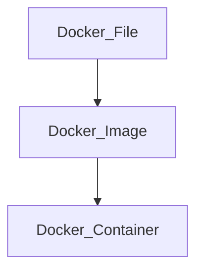

# nd2-learning-journey-2025

## DevOps Concepts for Automation Systems
### แนวคิด DevOps สำหรับระบบอัตโนมัติ: กรณีศึกษา Docker
การพัฒนาระบบอัตโนมัติ (Automation Systems) ในปัจจุบันมีความซับซ้อนสูง เนื่องจากระบบต้องประกอบด้วยหลายบริการที่ทำงานร่วมกัน เช่น ระบบประมวลผลข้อมูล ระบบสื่อสารเครือข่าย และระบบแสดงผลข้อมูล ปัญหาที่พบบ่อยคือความไม่สอดคล้องของสภาพแวดล้อมการพัฒนาและการติดตั้งใช้งาน (deployment environment) ซึ่งส่งผลต่อความเสถียรและความน่าเชื่อถือของระบบ แนวคิด DevOps จึงถูกนำมาใช้เพื่อเชื่อมโยงกระบวนการพัฒนาและการดูแลระบบให้เป็นอัตโนมัติและมีประสิทธิภาพมากขึ้น โดย Docker เป็นเทคโนโลยีสำคัญที่สนับสนุนแนวคิดดังกล่าว

     

### Docker และแนวคิด Containerization

Docker เป็นเทคโนโลยีที่ใช้แนวคิด Containerization ในการบรรจุแอปพลิเคชันพร้อมไลบรารีและการตั้งค่าที่จำเป็นทั้งหมดไว้ในหน่วยเดียวที่เรียกว่า Container ทำให้แอปพลิเคชันสามารถทำงานได้อย่างสม่ำเสมอในทุกสภาพแวดล้อม ไม่ว่าจะเป็นเครื่องพัฒนา ระบบทดสอบ หรือระบบใช้งานจริง Container มีความเบากว่า Virtual Machine เนื่องจากใช้ทรัพยากรร่วมกับระบบปฏิบัติการหลัก ส่งผลให้เหมาะสมกับระบบอัตโนมัติที่ต้องการประสิทธิภาพและความยืดหยุ่นสูง

### การประยุกต์ใช้ Docker ในระบบอัตโนมัติ
### Phase 1: การสร้างสภาพแวดล้อมมาตรฐาน (Environment Standardization)

ในระยะแรก Docker ถูกนำมาใช้เพื่อกำหนดสภาพแวดล้อมมาตรฐานของระบบผ่าน Docker Image ซึ่งนิยามด้วยไฟล์ Dockerfile ภายในจะระบุ runtime ไลบรารี และการตั้งค่าที่จำเป็นทั้งหมด แนวทางนี้ช่วยลดปัญหาความแตกต่างของสภาพแวดล้อมระหว่างผู้พัฒนาและระบบใช้งานจริง ทำให้ระบบอัตโนมัติสามารถทำงานได้อย่างถูกต้องและสม่ำเสมอ

### Phase 2: การบรรจุแอปพลิเคชัน (Application Containerization)

ในขั้นตอนนี้ ระบบอัตโนมัติจะถูกแยกออกเป็นส่วนย่อยตามหน้าที่ เช่น ระบบรวบรวมข้อมูล ระบบประมวลผล และระบบแสดงผล โดยแต่ละส่วนจะถูกรันอยู่ใน Container แยกจากกัน การแยกส่วนดังกล่าวช่วยลดผลกระทบเมื่อเกิดความผิดพลาดในบางบริการ และเพิ่มความสะดวกในการพัฒนาและปรับปรุงระบบเป็นรายส่วน

### Phase 3: การทำงานอัตโนมัติและกระบวนการ CI/CD

Docker ถูกผนวกเข้ากับกระบวนการ Continuous Integration และ Continuous Deployment (CI/CD) เพื่อทำให้การสร้าง ทดสอบ และติดตั้งระบบเป็นไปโดยอัตโนมัติ เมื่อมีการเปลี่ยนแปลงโค้ด ระบบสามารถสร้าง Docker Image ใหม่ ทำการทดสอบ และนำไปติดตั้งได้ทันที กระบวนการนี้ช่วยลดข้อผิดพลาดจากมนุษย์ และเพิ่มความรวดเร็วในการพัฒนาระบบอัตโนมัติ

### Phase 4: การติดตั้งใช้งานและการขยายระบบ (Deployment and Scalability)

Docker ช่วยให้การติดตั้งระบบอัตโนมัติทำได้ง่ายและมีความยืดหยุ่นสูง โดยสามารถนำ Docker Image เดิมไปใช้งานในหลายสภาพแวดล้อม รวมถึงการเพิ่มจำนวน Container เพื่อรองรับภาระงานที่เพิ่มขึ้น แนวทางนี้ช่วยให้ระบบสามารถขยายตัวได้ตามความต้องการโดยไม่ต้องปรับโครงสร้างระบบใหม่ทั้งหมด

### Phase 5: การดูแลรักษาและความเสถียรของระบบ (Operation and Maintenance)

ในระยะการใช้งานจริง Docker สนับสนุนการดูแลระบบอัตโนมัติในระยะยาว เช่น การรีสตาร์ตบริการที่เกิดความผิดพลาด การย้อนกลับเวอร์ชัน (rollback) และการแยกตรวจสอบปัญหาเป็นราย Container ส่งผลให้ระบบมีความเสถียรและลดระยะเวลาหยุดทำงาน (downtime)

### บทสรุป

Docker เป็นองค์ประกอบสำคัญของแนวคิด DevOps สำหรับระบบอัตโนมัติ โดยช่วยเปลี่ยนกระบวนการพัฒนาระบบจากการดำเนินการแบบแมนนวลไปสู่ระบบอัตโนมัติที่มีมาตรฐานเดียวกัน ช่วยเพิ่มความน่าเชื่อถือ ความยืดหยุ่น และความสามารถในการขยายระบบ การประยุกต์ใช้ Docker จึงเป็นพื้นฐานสำคัญสำหรับการพัฒนาระบบอัตโนมัติและระบบอัจฉริยะในยุคปัจจุบัน
## Front-End & Back-End

## Data Processing and AI

## Deployment & Automation Workflow

## Future Works/Projects
